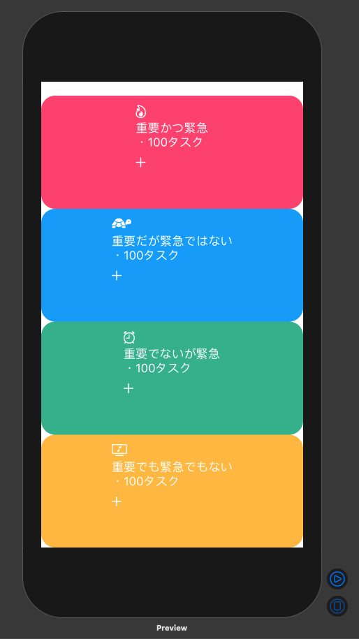
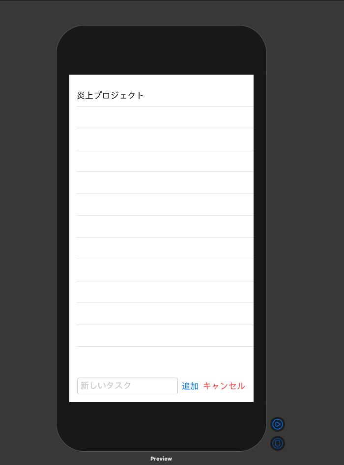

# swiftui_todo_kobashou06
i am studying https://www.udemy.com/course/swiftui-todo/

# Todoアプリ開発環境

- Swift

- SwiftUI

- Xcode

# アプリ画面(未完成)

## タスク重要度カテゴリ

## タスク一覧表示

# 残りやるべきこと

- 今まで作った各Viewの組み立て作業

- レイアウトを整えていく

- MVVM設計になっているのか？
